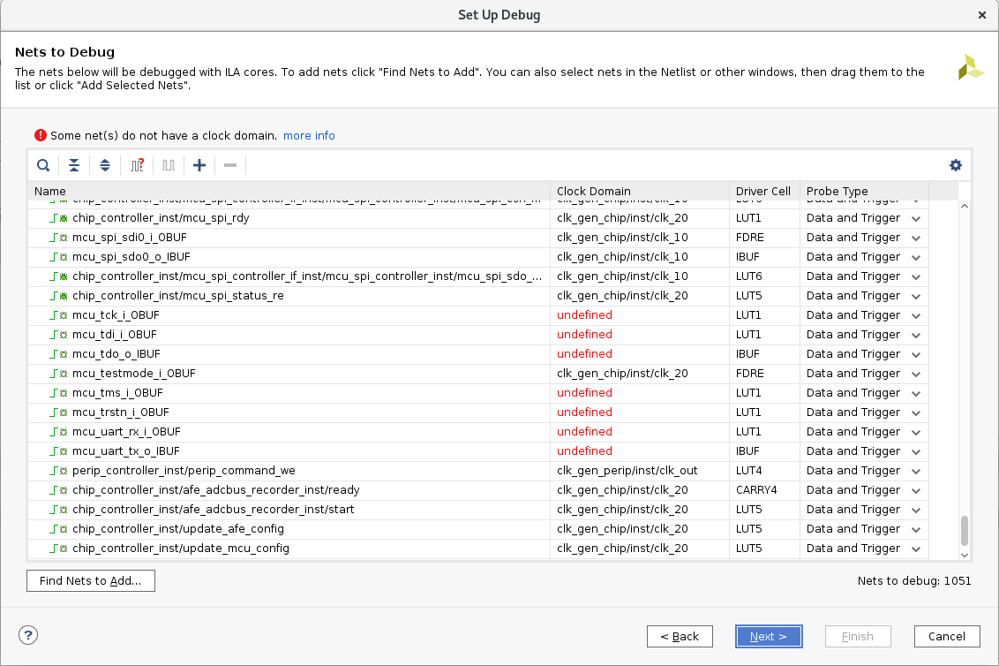
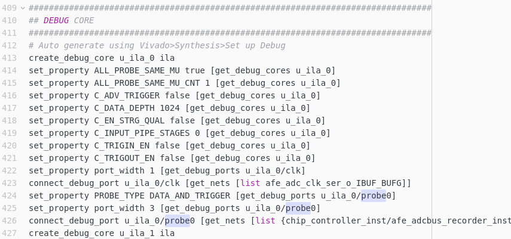
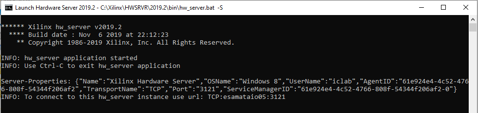
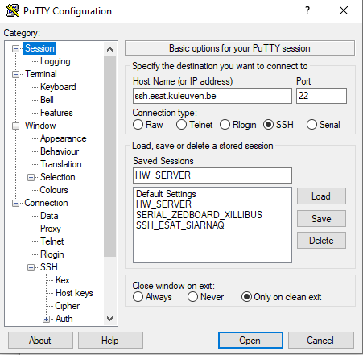
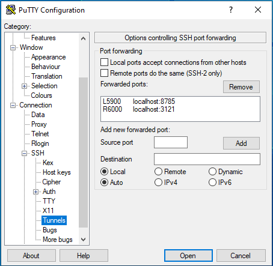
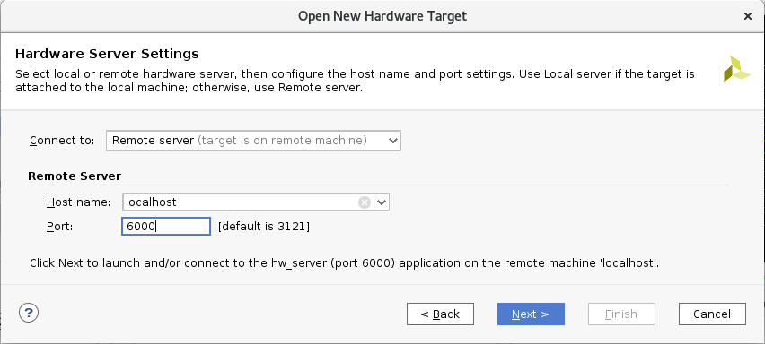
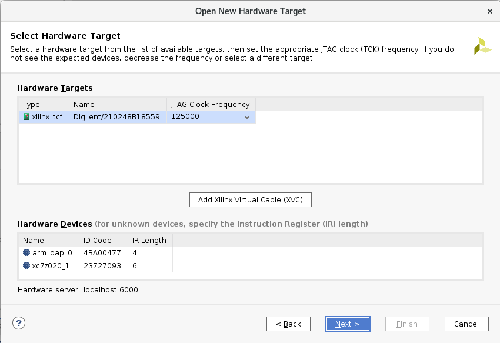
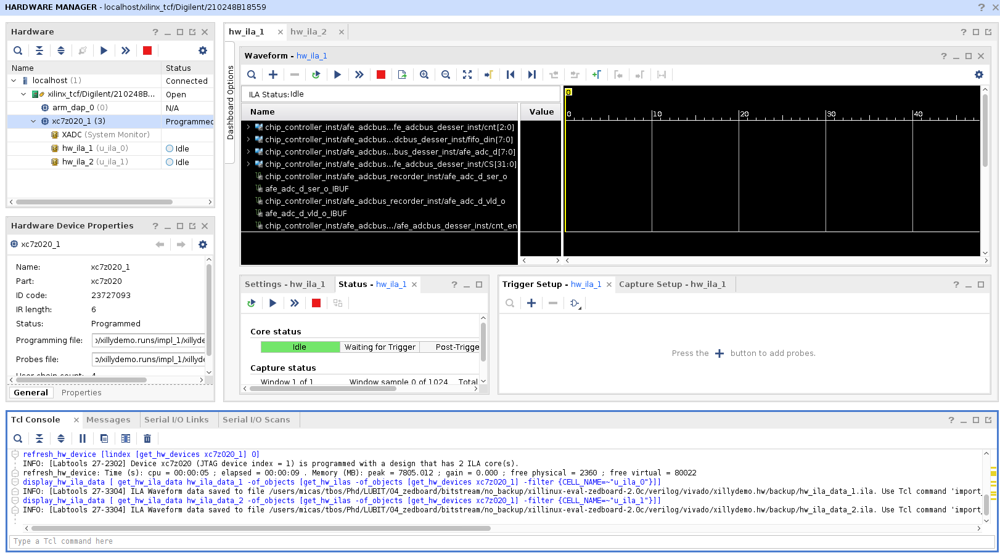
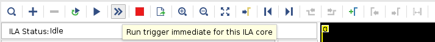
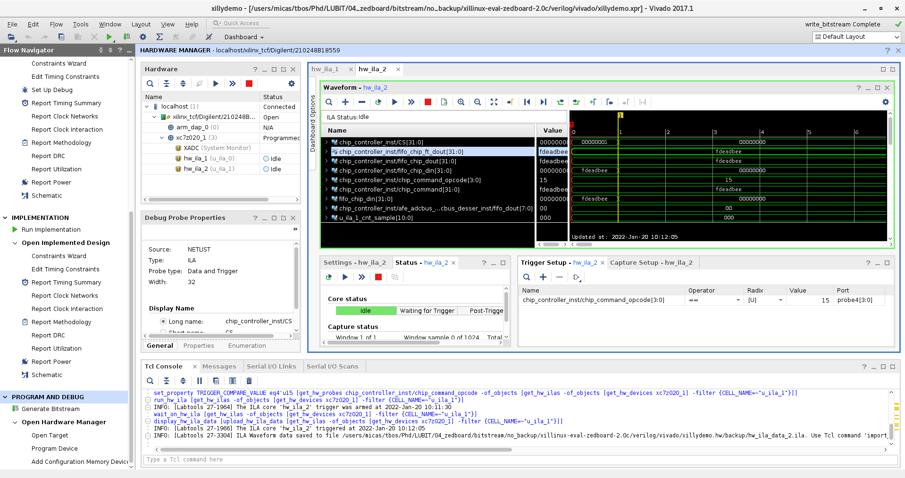

# Documentation on Vivado HW debugger

## Requirements

Drawing of a typical lab setup:

* Hardware: zedboard, Windows machine (All-in-One or laptop), USB-cable between ZB/prog and WinPc, correct functioning ethernet of zedboard and WinPc, your own officePc, vnc session running on your officePc.
* Software:
  - Xilinx HW server on WinPc
  - Putty/Kitty/Bash on WinPc for ssh tunneling

## Install

### Vivado HW server
Install **Vivado 2017.1 Hardware Server for Windows** on your WinPc. You can find the download on the [Xilinx Vivado Archive](https://www.xilinx.com/support/download/index.html/content/xilinx/en/downloadNav/vivado-design-tools/archive.html).

Known installation issues:
* HWSRVR 2017.1: Visual C++ redistribution not supported.
  - reported and solved by following [forum thread](https://support.xilinx.com/s/question/0D52E00006hpcvq/problem-with-vivado-20171-and-visual-studio-2017?language=en_US) (also available on wayback machine).
  - tldnr: In loader.bat, search for "Microsoft Visual C\+\+" and you will see a block of script that checks the version, I just removed that block of script.

## Procedure
1. First make sure you can create a correctly implemented Xilinx bitstream.
2. Insert `(* mark_debug = "true" *)` attributes on signals you wish to probe
  - Do not put them on output buffers
  - Put on all signals desiring to debug. Note that afterwards you easily can discard signals from different clock domains.
3. In Vivado: Synthesis > Open Synthesized Design > Set Up Debug
  - In case you have an existing debug core, first disconnect all nets.
  - Following screen should look like this:
  
  - Allow all signals to be probed for data and trigger
  - Do not exaggerate on number of probes as the HW debugger is implemented in FF slices. Do not go over 250-300 probes.
  - Nets without a clock domain (red color in screenshot) are typically due to io buffers or other nets that cannot be probed.
  - By default use a low window sample: 1024. If after simulation you need more clock cycles to debug the signal increase it.
  - When closing the synt_design you save the debugcore. Your xillydemo.xdc constraint file now should be appended with the debugcore probe entries. Your xdc-file ending should look like this:
  
4. Resynth, impl and generate bitstream for the project.
5. Program the bitstream to Zedboards SD card + reboot Zedboard.
6. Connect PROG cable to WinPc.
7. Start the Xilinx HW server on WinPc. You should get following terminal output:
  
8. Setup the HW server tunneling from WinPc to officePc.
  - Putty session screenshots below. Save your session for quick access (here HW_SERVER).  
  
  
  - In the putty terminal, further tunnel to your officePc:
  `ssh -L 8785:localhost:5917 -R 6000:localhost:6000 <officePcName>`. You can put this in your .bashrc for quick access.
9. Go to your officePc and open Vivado (or better, open the VNC session with Vivado running on your officePc).
  - In Vivado: Program and Debug > Open Hardware Manager > Open Target > Open New Target
  - Enter following in pop up wizard:
  
  - If are connected to your zedboard locally choose local server.
  - Next window should look like this:
  
    
    - Start with the lowest JTAG speed as this determines the slowest clock you can debug. Only increase the JTAG speed when knowing you will not have any clock issue and when you desire a faster debug data transfer speed.
    - Known issue of not detecting HW Devices: go back and next in the 'Open HW Target Wizard'.
10. Finally your Vivado environment should look like this:
  
  - Tcl console correctly detected your amount of ILA core(s).
  - Check that you can invoke an immediate trigger and view your signals. Don't forget the specify the field Value:
  
11. Click on "Run trigger for this ILA core" and in your zedboard run python and send a command.
  -  `. ./env/bin/activate`
  -  `ipython`

12. Debug any warnings issues popping up during searching for the debug core. Some ideas:
  - Sometimes you need to do a fresh restart because Vivado is a complex tool.
  - Did you copy the correct bitfile and reboot your zedboard?

## HW debugger usage

An example screenshot of the debugger window:

1. I did trigger on the `chip_command_opcode[3:0]` to become 15 (which is my test_fifo_writeback chip_fifo command).
2. You can see and debug the different mark_debug signals
3. Note that this design contains 2 separate debug cores: hw_ila_1 and hw_ila_2. This because I'm debugging two different clock domains simultaneously.

## Known issues
When in trouble, check the following:
* Are your vivado version and HW server version equal?
* Limit your debug core size to 200-300 probes.
* Do not put debug core on your IO.
* Sometimes a fresh restart and recompile of your Vivado project is needed.
* Remove and re-initialise your HW target link.
* Your constraints file order might matter.
